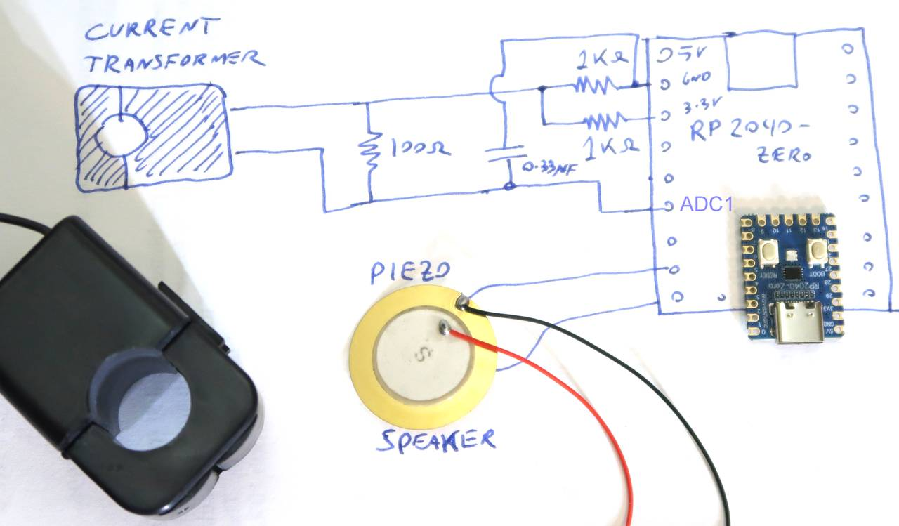

<html>
<body>
<h1>What micro_mon does</h1>
micro_mon is a project for the Raspberry pi pico, specifically the
wavershare RP2040-Zero.  This is essentially a smaller PCB version of the
rapsberry pi pico, with a color LED on it.

The project monitors current using a current transformer feeding into the A/D converter
on teh pico.  It can detect microwaving by the high current draw, and opening the
microwave door by the current draw from the light bulb inside the oven.

If somethign is microwaved, but we miss the beep for when its done and forget about
it, this will periodically beep until the microwave door is opened to retrieve
the food.

<h1>Schematic</h1>

<h1>Build environment</h1>
This relies on a command line based build environment, either running on a
Raspberry PI 4 or under windows WSL.

Please see "dev env setup notes.txt" for how to set this up on a pi.

Or see "windows dev setup.txt" for how to set up the build environment under windows.

<h1>Pieces you might want to re-use</h1>

Simple code to program the 3-color LED on the wavershare RP2040-Zero

Code to compute a measure of current from A/D readings from the current transformer

Code to beep a piezo speaker connected to the pico.
 

<h1>License</h1>

micro_mon is licensed under the GPL version 2 (not version 3)
For details, please see here: 
<a href="http://www.gnu.org/licenses/old-licenses/gpl-2.0.en.html">http://www.gnu.org/licenses/old-licenses/gpl-2.0.en.html</a>

This program is free software; you can redistribute it and/or
modify it under the terms of the GNU General Public License
as published by the Free Software Foundation version 2
of the License.

This program is distributed in the hope that it will be useful,
but WITHOUT ANY WARRANTY; without even the implied warranty of
MERCHANTABILITY or FITNESS FOR A PARTICULAR PURPOSE.  See the
GNU General Public License for more details (docs/license.txt)
